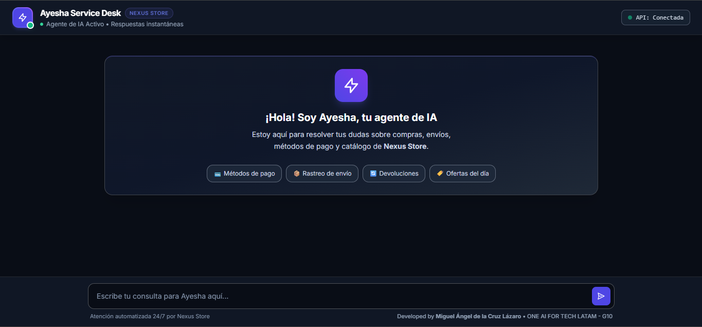
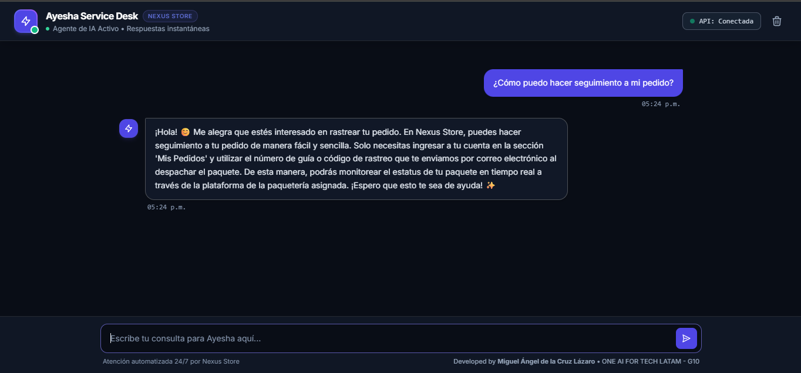

<p align="center">
  
</p>

# 💬 Nexus Store - Ayesha Chat Frontend

---

<p align="center">
  
  
  
  
  
</p>

Interfaz de usuario moderna, fluida y altamente responsiva para el **agente de IA de Nexus Store (Ayesha)**. Está desarrollada con un estilo corporativo oscuro utilizando **Tailwind CSS** y **Vanilla JavaScript**, conectándose de forma asíncrona a la API REST basada en **FastAPI** desplegada en la nube.

---

* **🌐 Despliegue en Vivo (Render):** [Probar Aplicación Web](https://ayesha-servicedesk-chat.onrender.com)
* **⚡ Backend API (Railway):** [Ver Servicio Conectado](https://ia-agent-e-commerce-production.up.railway.app/docs)
* **💻 Repositorio del Backend:** [Ver código en GitHub](https://github.com/Miguel-Dark/ia-agent-ecommerce)

---

### 🚀 Características Principales

* **Interfaz Fluida y Responsiva:** Diseño adaptado para dispositivos móviles y de escritorio utilizando **Tailwind CSS** y modo oscuro nativo.
* **Indicador de Estado de la API:** Monitoreo visual en tiempo real de la conexión con el servidor backend.
* **Historial de Conversación:** Persistencia temporal en la sesión del navegador (`sessionStorage`) para no perder el hilo de las consultas.
* **Accesos Rápidos Interactivos:** Tarjetas interactivas en la vista de bienvenida para consultas frecuentes (métodos de pago, rastreo de envíos, devoluciones y ofertas).
* **Configuración Dinámica:** Modal integrado para cambiar el endpoint de la API REST de forma flexible si el servidor cambia de puerto o IP.
* **Funcionalidad de Copiado Rápido:** Botón en cada respuesta del agente para copiar el texto directamente al portapapeles con un solo clic.

---

### 🛠️ Tecnologías Utilizadas

* **Frontend Estático:** **HTML5** y **Vanilla JavaScript (ES6+)** para la gestión del DOM, control de eventos y comunicación asíncrona mediante peticiones `fetch`.
* **Estilos y Diseño:** **Tailwind CSS** aplicado mediante CDN para un rendimiento óptimo y diseño adaptable.
* **Integración Backend:** Comunicación directa vía API REST con **FastAPI**, procesando esquemas JSON estructurados.

---

## 🖼️ Vista General de la Interfaz en Producción

* **Panel Principal y Chat con Ayesha (Render):**
  <p align="center">
    
  </p>

---

### ⚙️ Instrucciones de Ejecución Local

Sigue estos pasos para clonar y poner en marcha esta interfaz frontend en tu entorno de desarrollo local:

### 1. Clonar el Repositorio
```bash
git clone https://github.com/Miguel-Dark/nexus-store-chat.git
cd nexus-store-chat
```

### 2. Abrir el Proyecto
Al tratarse de una aplicación frontend basada en archivos estáticos (index.html, style.css, script.js), puedes abrirla de dos formas sencillas:

- Directamente: Haz doble clic en el archivo index.html para abrirlo en tu navegador web predeterminado.
- Con un Servidor Local (Recomendado): Si utilizas Visual Studio Code, abre la carpeta del proyecto y activa la extensión Live Server para levantar un entorno local en vivo.

### 3. Conectar con el Servidor Backend
> **Nota Importante:** Asegúrate de tener en ejecución tu servidor FastAPI del agente en tu entorno local (ejecutándose por defecto en el puerto `8000`), o bien, apunta la interfaz directamente al enlace de producción desplegado en Railway si prefieres no levantar el backend localmente. La interfaz se enlazará de forma automática. Si requieres cambiar la ruta de conexión, haz clic en el ícono de configuración (`⚙️`) ubicado en la esquina superior derecha de la interfaz web.

Developed by **Miguel Ángel de la Cruz Lázaro** como complemento frontend del ecosistema de Inteligencia Artificial para comercio electrónico.

---